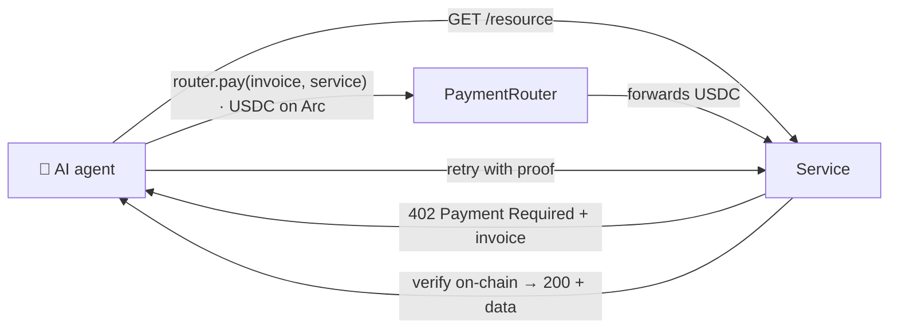

# Arc Pump — pay-per-call payments for AI agents on Arc

**A payment rail where autonomous AI agents pay per request in USDC on Arc** — metered,
capped, settled and verified on-chain. No subscriptions, no API keys, no humans in the loop.

- 🟢 **Live demo (interactive):** https://arcpump.com/pay — click **Run it** to watch a real
  AI agent pay 0.01 USDC on Arc to unlock a resource, with the on-chain transaction. Or
  connect a wallet and pay it yourself.
- 📄 **PaymentRouter (Arc testnet):** [`0x42bCE0…28ff`](https://testnet.arcscan.app/address/0x42bCE0940b286b29A7bE50c3C7c89302A48E28ff)
- 🔌 **Demo paid service:** https://agentpay-service.arcpump2403.workers.dev/premium

## The problem

As autonomous AI agents start doing real work, they need to pay for the services they
consume — APIs, data, compute. But today's payments are built for humans: subscriptions,
API keys, checkout with a card. None of that fits a machine that makes one call, once,
with no human in the loop.

## How it works (x402-style)



1. **Request** — the agent hits a paid resource and gets `402 Payment Required` + an invoice.
2. **Pay** — its **Circle Programmable Wallet** (MPC, no raw key) pays the invoice through the
   on-chain **PaymentRouter** in native USDC — within a per-call cap and a total budget.
3. **Unlock** — the service verifies the payment on-chain (bound to the invoice **and** the
   recipient) in one view call, then serves the response. One payment, one call.

Native USDC on Arc has no memo field, so a raw transfer can't be tied to an invoice — the
small `PaymentRouter` contract fixes that by binding every payment to its invoice + recipient.

## Repository layout (the rail)

```
src/PaymentRouter.sol         invoice-bound native-USDC settlement router (deployed on Arc)
agentpay/service/             "sell side": HTTP 402 wrapper + on-chain verify + serve + ledger
agentpay/client/payfetch.mjs  "buy side": payAndFetch() with per-call + total-budget guardrails
frontend/app/pay/             landing + interactive playground + live ledger (arcpump.com/pay)
agentpay/ArcPump-deck.pdf     pitch deck
```

## Run it

**Live** — just open https://arcpump.com/pay and click **Run it**.

**From the terminal:**

```bash
# 1) get an invoice (402)
curl https://agentpay-service.arcpump2403.workers.dev/premium

# 2) pay router.pay(invoiceId, service) with 0.01 USDC on Arc, then retry:
curl "https://agentpay-service.arcpump2403.workers.dev/premium?invoice=<id>"
```

**From an agent (the pay-client):**

```js
import { createPayer } from "./agentpay/client/payfetch.mjs";

const payer = createPayer({ circle, walletId, maxPerCall: 0.05, budget: 1 });
const { data } = await payer.payAndFetch("https://…/premium");
// → 402 → pays 0.01 USDC on Arc within its caps → 200 + data
```

## Built on

- **Circle Programmable Wallets** (Developer-Controlled, MPC) — agents sign autonomously; no
  private key on any server.
- **Native USDC on Arc** — payments are plain value transfers, final in ~1 second.
- **Solidity** (PaymentRouter, Foundry) · **Cloudflare Workers** (service + ledger) ·
  **Next.js** (landing) · **viem** (Arc reads). AI-assisted development throughout.

---

*This repository also contains an earlier iteration the project evolved from — a USDC-native
launchpad with an autonomous agent fleet (`src/MemeFactoryV2.sol`, `agent/`, `agent-dashboard/`,
`frontend/app/agent`, live at [agent.arcpump.com](https://agent.arcpump.com)). We pivoted from
that into the pay-per-call payment rail above. For educational and testnet demo purposes only.*
