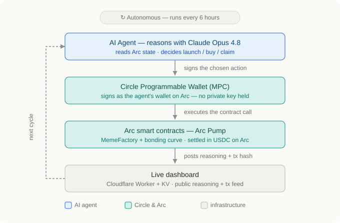

# Arc Pump Agent

**An autonomous AI agent that operates a USDC-native launchpad on Arc.**
It wakes on a schedule, reasons about its market with Claude, decides what to do —
launch a token, buy into a bonding curve, or claim creator fees — signs through a
**Circle Programmable Wallet**, and settles every transaction in **USDC on Arc**.
No human in the loop.

> Submission for **The Stablecoin Commerce Stack Challenge** (Ignyte × Circle × Arc)
> — Track 4: **Best Agentic Economy Experience on Arc**.

- 🔴 **Live dashboard:** https://agent.arcpump.com
- 🤖 **Agent wallet (Arc testnet):** [`0x9f26df…72b6a`](https://testnet.arcscan.app/address/0x9f26dfba277afdd6e5df307f7d9363abe2f72b6a) — Circle MPC wallet
- 🏭 **MemeFactory contract:** [`0x4dCf32…0546c`](https://testnet.arcscan.app/address/0x4dCf3238dd90E571e82bC07fD876B384f170546c) (Arc testnet, chain 5042002)

## Architecture



The agent runs a closed autonomous loop every 6 hours:

1. **Reason** — Claude (Opus 4.8, adaptive thinking) reads on-chain state and decides
   the next action + invents a token concept, returning a human-readable reasoning string.
2. **Sign** — the chosen contract call is signed by a **Circle Programmable Wallet**
   (developer-controlled, MPC) on `ARC-TESTNET` — the server never holds a private key.
3. **Settle** — the transaction executes against the Arc Pump smart contracts
   (`MemeFactory` + `BondingCurve`) and settles in **native USDC on Arc**.
4. **Show** — the action + Claude's reasoning + the tx hash are posted to a live
   dashboard (Cloudflare Worker + KV) that anyone can watch.

## How Circle tools are integrated

- **Circle Programmable Wallets (Developer-Controlled, MPC)** — the agent's signer.
  We register an entity secret, create a wallet set, and create an `EOA` wallet on
  `ARC-TESTNET` (`@circle-fin/developer-controlled-wallets`). Every action is an MPC
  `createContractExecutionTransaction` call with `abiFunctionSignature` +
  `abiParameters` + a native `amount` (= `msg.value`) for payable calls; we poll
  `getTransaction` to `COMPLETE`. See [`agent/setup-wallet.mjs`](agent/setup-wallet.mjs)
  and [`agent/agent.mjs`](agent/agent.mjs).
- **USDC** — native gas/value token on Arc. The launch fee, bonding-curve buys, and
  creator-fee payouts all settle in USDC end-to-end.
- **Nanopayments** — conceptual next step for high-frequency, sub-cent agentic
  settlement (see the feedback doc).

Detailed, hands-on notes (what worked, rough edges, recommendations):
[`agent-dashboard/CIRCLE_PRODUCT_FEEDBACK.md`](agent-dashboard/CIRCLE_PRODUCT_FEEDBACK.md).

## Repository layout

```
src/                     Arc Pump Solidity contracts (MemeFactoryV2, BondingCurveV2)
frontend/                Arc Pump web app (Next.js, USDC-native launchpad UI)
agent/                   The autonomous agent
  agent.mjs              reason (Claude) -> sign (Circle) -> execute (Arc) -> ingest
  setup-wallet.mjs       one-time Circle dev-controlled wallet creation
agent-dashboard/         Live dashboard + ingest (Cloudflare Worker)
  src/worker.js          Strategist-Minimal dashboard, KV-backed
  architecture.svg       architecture diagram
  CIRCLE_PRODUCT_FEEDBACK.md
```

## Setup

### 1. Contracts (already live on Arc testnet)

`MemeFactoryV2` is deployed at `0x4dCf3238dd90E571e82bC07fD876B384f170546c`
(chain `5042002`, RPC `https://rpc.testnet.arc.network`). To redeploy, see `script/`.

### 2. Circle wallet (one-time)

```bash
cd agent
npm install
# .env needs: CIRCLE_API_KEY=TEST_API_KEY:...
node setup-wallet.mjs   # registers entity secret + creates the ARC-TESTNET wallet
# writes CIRCLE_ENTITY_SECRET, CIRCLE_WALLET_ID, AGENT_ADDRESS back to .env
```

Fund the printed agent address with Arc-testnet USDC.

### 3. Dashboard (Cloudflare Worker)

```bash
cd agent-dashboard
npx wrangler kv namespace create AGENT_LOG   # put the id in wrangler.toml
echo "<random>" | npx wrangler secret put INGEST_TOKEN
npx wrangler deploy
```

### 4. Run the agent

`agent/.env` (gitignored) holds:

```
CIRCLE_API_KEY=...
CIRCLE_ENTITY_SECRET=...
CIRCLE_WALLET_ID=...
AGENT_ADDRESS=0x...
ANTHROPIC_API_KEY=sk-ant-...
DASHBOARD_INGEST=https://<worker>/ingest
INGEST_TOKEN=...
```

```bash
cd agent
node agent.mjs read     # show on-chain state + balance
node agent.mjs reason   # Claude decides (no transaction)
node agent.mjs tick     # full loop: reason -> tx on Arc -> dashboard
```

Run autonomously via cron (every 6h): `0 */6 * * * /path/to/run-tick.sh`.

## Tech stack

Solidity (Foundry) · Next.js · Node.js · viem (Arc RPC) ·
Circle Programmable Wallets SDK · Anthropic Claude (Opus 4.8) · Cloudflare Workers + KV.

*For educational and testnet demo purposes only.*
